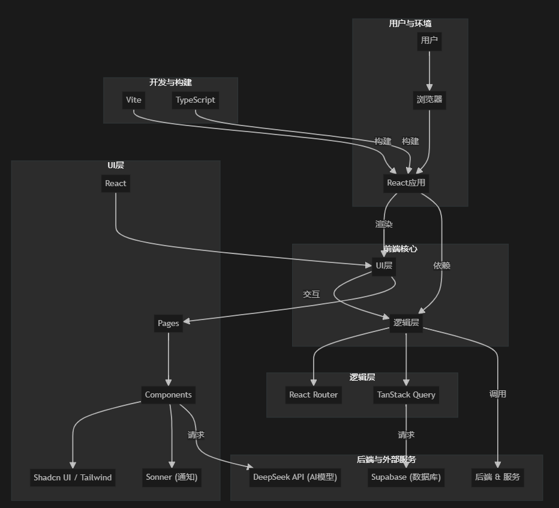

# Chat Arena Sandbox - AI对话竞技场沙箱

> 一个用于测试和评估AI模型在不同场景和攻击性提示下表现的多客户端聊天环境

## 🎯 项目概述

Chat Arena Sandbox 是一个专为AI模型测试设计的沙箱环境，允许用户创建多个虚拟AI客户端，并通过自动化或手动方式进行对话测试。该项目特别适用于：

- **AI安全性测试**：测试模型对各种攻击性提示的抵抗能力
- **模型性能评估**：在不同场景下评估AI模型的回复质量
- **大规模并发测试**：支持多客户端同时进行对话测试
- **数据收集与分析**：自动记录对话数据并提供可视化分析

## ✨ 核心功能

### 🤖 AI客户端管理

- 创建和配置多个虚拟AI客户端
- 自定义每个客户端的系统提示、名称、类别
- 设置消息上限和随机生成选项
- 关联测试用例库

### 🔄 灵活的测试模式

- **全局自动模式**：所有激活的客户端并发执行对话
- **单客户端手动模式**：逐步控制单个客户端的对话流程
- **混合模式**：部分客户端自动，部分手动控制

### 📊 测试用例系统

- 预定义攻击类型和测试场景
- 支持随机生成相似但不同的测试提示
- 分类管理不同类型的测试用例

### 💾 数据存储与分析

- 基于Supabase的云端数据存储
- 完整的对话历史记录
- 攻击热力图可视化
- 测试结果统计分析

### 🔔 智能通知系统

- 实时状态提醒（如消息上限警告）
- 非侵入式Toast通知（右上角显示）
- 自动关闭和手动关闭选项

## 🛠 技术栈

### 前端框架

- **React 18** - 现代化UI框架
- **TypeScript** - 类型安全的JavaScript
- **Vite** - 极速构建工具

### UI组件与样式

- **Shadcn UI** - 现代化组件库
- **Radix UI** - 无障碍UI基础组件
- **Tailwind CSS** - 实用优先的CSS框架
- **Lucide React** - 优雅的图标库

### 状态管理与数据

- **TanStack Query** - 服务端状态管理
- **React Router** - 客户端路由
- **React Hook Form** - 表单状态管理

### 后端服务

- **Supabase** - 后端即服务(BaaS)平台
- **DeepSeek API** - AI大语言模型服务

### 通知与交互

- **Sonner** - 优雅的Toast通知系统
- **React Resizable Panels** - 可调整面板布局

## 🏗 项目架构

```
src/
├── components/           # 可复用UI组件
│   ├── ui/              # Shadcn UI基础组件
│   ├── ClientChatRoom.tsx    # 核心：单个AI客户聊天室
│   ├── SystemPromptEditor.tsx # 系统提示编辑器
│   └── AttackHeatmapModal.tsx # 攻击热力图模态框
├── hooks/               # 自定义React Hooks
├── integrations/        # 第三方服务集成
│   └── supabase/        # Supabase客户端配置
├── pages/               # 应用页面
│   ├── Index.tsx        # 主页
│   ├── MultiClientChat.tsx   # 多客户端聊天页面
│   └── SingleClientChat.tsx  # 单客户端聊天页面
└── App.tsx              # 应用根组件
```



## 🚀 快速开始

### 环境要求

- Node.js 18+
- npm 或 bun 包管理器

### 安装步骤

1. **克隆项目**

```bash
git clone <YOUR_GIT_URL>
cd chat-arena-sandbox
```

2. **安装依赖**

```bash
# 使用 npm
npm install

# 或使用 bun（推荐，更快）
bun install
```

3. **启动开发服务器**

```bash
# 使用 npm
npm run dev

# 或使用 bun
bun run dev
```

4. **访问应用**
   打开浏览器访问：http://localhost:8080

### 配置说明

1. **DeepSeek API密钥**：在设置页面配置您的DeepSeek API密钥
2. **Supabase配置**：确保Supabase项目正确配置（通常已预配置）

## 📱 使用指南

### 创建AI客户端

1. 在主页点击"添加客户端"
2. 填写客户端信息（名称、类别、系统提示等）
3. 设置最大消息数和测试选项
4. 保存并激活客户端

### 开始测试

1. **自动模式**：点击"全局自动"开始所有客户端的并发测试
2. **手动模式**：单击客户端的播放按钮进行逐步测试
3. **查看结果**：实时查看对话内容和测试进度

### 数据分析

- 点击客户端的热力图图标查看攻击分析
- 在Supabase后台查看完整的对话记录
- 导出数据进行进一步分析

## 🔧 开发命令

```bash
# 开发服务器
npm run dev / bun run dev

# 构建生产版本
npm run build / bun run build

# 预览生产构建
npm run preview / bun run preview

# 代码检查
npm run lint / bun run lint

# 部署到GitHub Pages
npm run deploy / bun run deploy
```

## 🌐 部署选项

### Vercel部署（推荐）

1. 连接GitHub仓库到Vercel
2. 自动检测为Vite项目
3. 一键部署

### GitHub Pages

```bash
npm run deploy
```

### 自定义域名

参考：[Setting up a custom domain](https://docs.lovable.dev/tips-tricks/custom-domain#step-by-step-guide)

## 🤝 贡献指南

1. Fork本项目
2. 创建功能分支 (`git checkout -b feature/AmazingFeature`)
3. 提交更改 (`git commit -m 'Add some AmazingFeature'`)
4. 推送到分支 (`git push origin feature/AmazingFeature`)
5. 开启Pull Request

## 📄 许可证

本项目采用MIT许可证 - 查看 [LICENSE](LICENSE) 文件了解详情

## 🔗 相关链接

- **Lovable项目页面**: https://lovable.dev/projects/95adfb3c-313a-4f2f-95f6-55a6f8631753
- **DeepSeek API文档**: https://platform.deepseek.com/api-docs/
- **Supabase文档**: https://supabase.com/docs
- **Shadcn UI文档**: https://ui.shadcn.com/

## 📞 支持与反馈

如果您在使用过程中遇到问题或有改进建议，请：

1. 查看现有的[Issues](../../issues)
2. 创建新的Issue描述问题
3. 参与讨论和改进

---

**感谢使用 Chat Arena Sandbox！** 🎉
